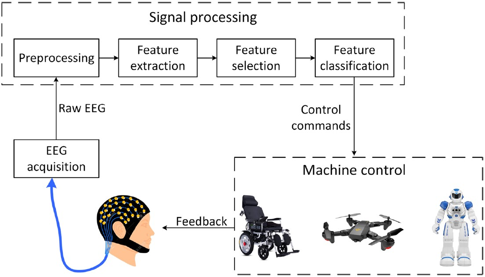
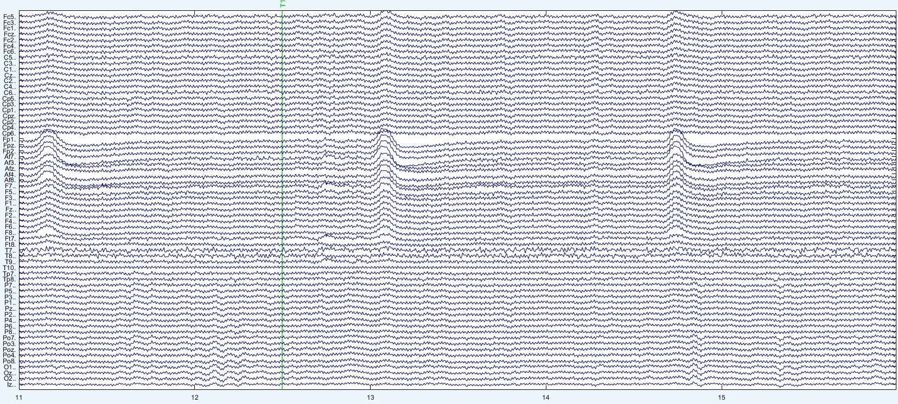
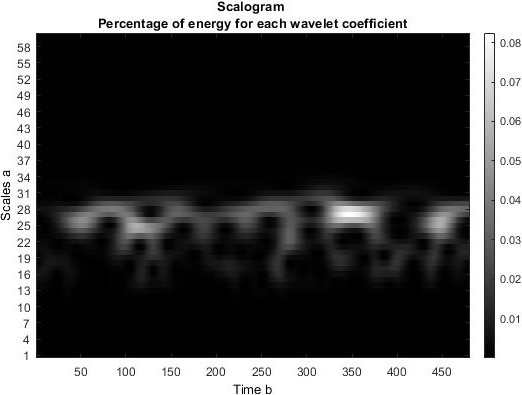

# EEG Motor Imagery Classification

> ***Even if someone is unable to perform a certain task it
does not mean that they cannot imagine it***

The objective of this project is to take steps in motor
imaginary classification based on EEG(Electroencephalogram)
signals and reduce the gap between dream and reality.
Full details regarding the results of this research project
can be found [***here***](https://github.com/Markis-Iustin-Ioan-30126/EEG-Motor-Imagery-Classification/blob/main/EEG_Motor_Imagery_Classification.pdf).

A general BCI system structure
is shown, with other words a BCI system architecture can
take the form of a closed loop control system.

## EEG (***Electroencephalogram***) signals

For the purpose of this project an open database that has various sets of data available for researchers was used,
the database is available on physionet.org. From this 
database a motor imagery specific data set was used. The
EEG recordings were gathered from 109 volunteers that
performed different motor imagery tasks while 64 
channels of EEG were recorded, such data is presented below:

## Classification using Convolutional Neural Networks
In recent research studies better results were found 
using Deep Learning, by training a model based on a deep
neural network such as a CNN(Convolutional Neural Networks).
The Wavelet Transform was used to obtain a Scalogram 
that maps the time-frequency analysis into an image

Such images were used as input for the neural network 
in order to perfom the cassification task. The results and 
conclusions of the project are presented [***here***](https://github.com/Markis-Iustin-Ioan-30126/EEG-Motor-Imagery-Classification/blob/main/EEG_Motor_Imagery_Classification.pdf).
